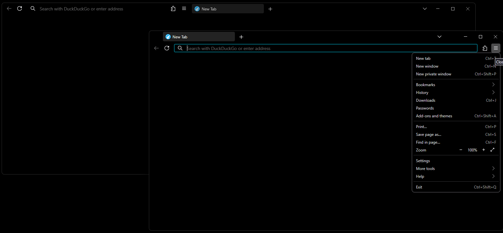

# Minimal Firefox theme

- When width > 1440px, puts tabs and address bar on one line
- Hides forward button when unavailable
- Dark background for OLED monitor
- Minimal, compact UI

## Installation

1. In the `about:config` page, set:
   - `toolkit.legacyUserProfileCustomizations.stylesheets` to `true`
   - `browser.uidensity` to `1`
2. In the `about:profiles` page, open the folder for the Root Directory of the current profile in use, make a new folder called `chrome` and copy the files `userChrome.css` and `userContent.css` inside.
3. Restart Firefox (`Ctrl`+`Alt`+`R`) for any changes to take effect.

## Recommended Layout

- Hide bookmarks toolbar and unused buttons

