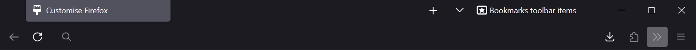
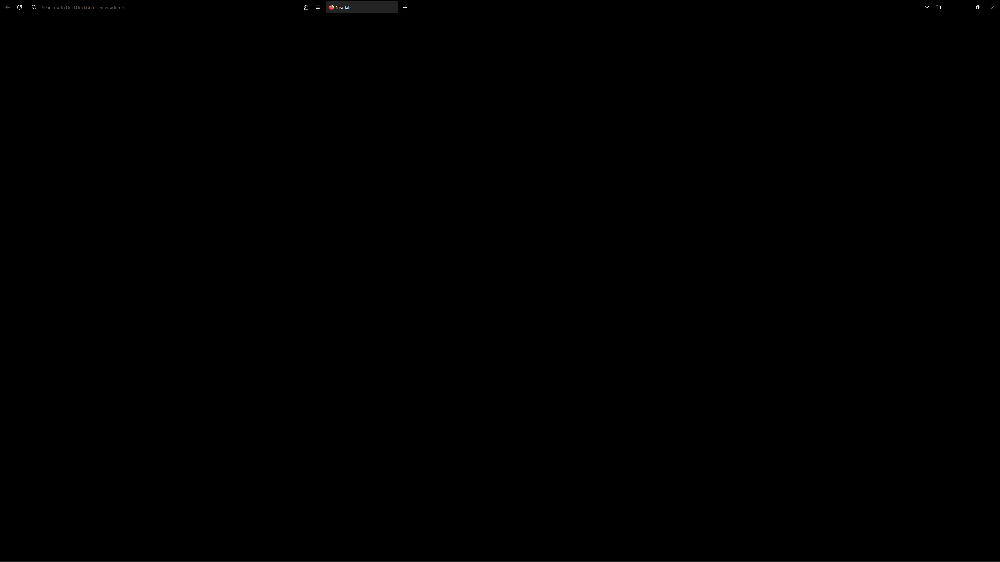
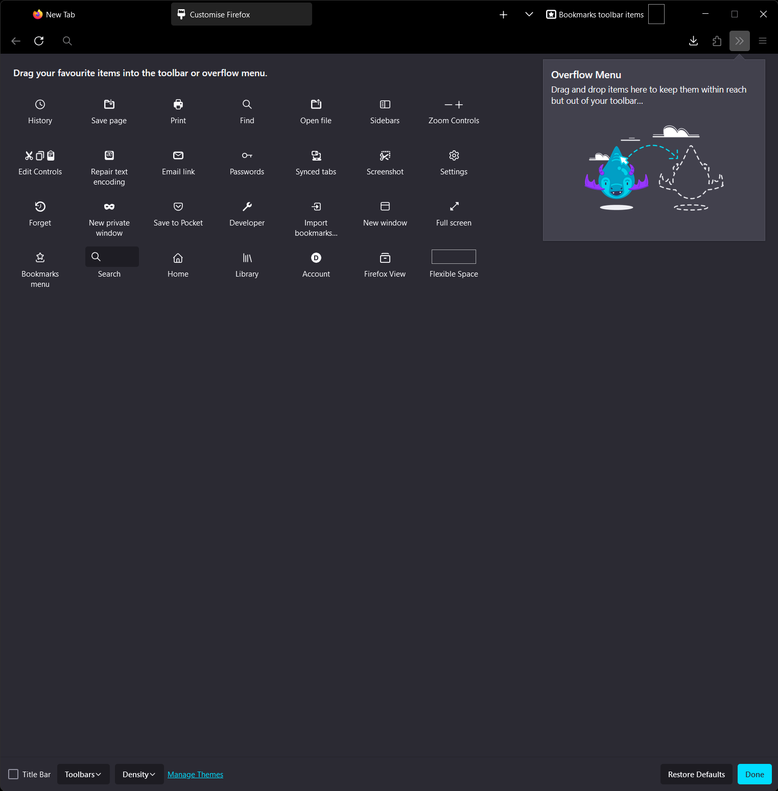

# Minimal vanilla Firefox theme

- When width > 1440px, puts tabs and address bar on one line
- Hides forward button when unavailable
- Black theme for OLED monitor
- Minimal design

Example window when width below 1440px:

Example window when width above 1440px:

Suggested layout:

## Installation

1. In the `about:config` page, set `toolkit.legacyUserProfileCustomizations.stylesheets` to `true`
2. In the `about:profiles` page, open the folder for the Root Directory of the current profile in use, make a new folder called `chrome` and copy the files `userChrome.css` and `userContent.css` inside.
3. Fully close and reopen Firefox for any changes to take effect.
